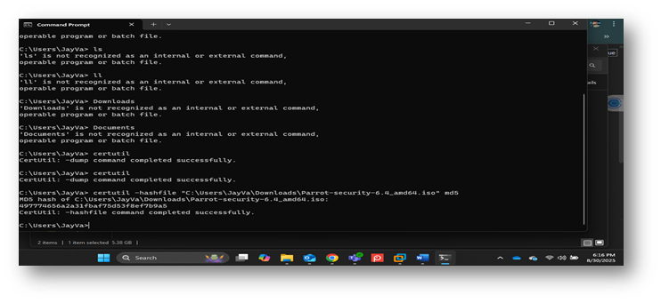
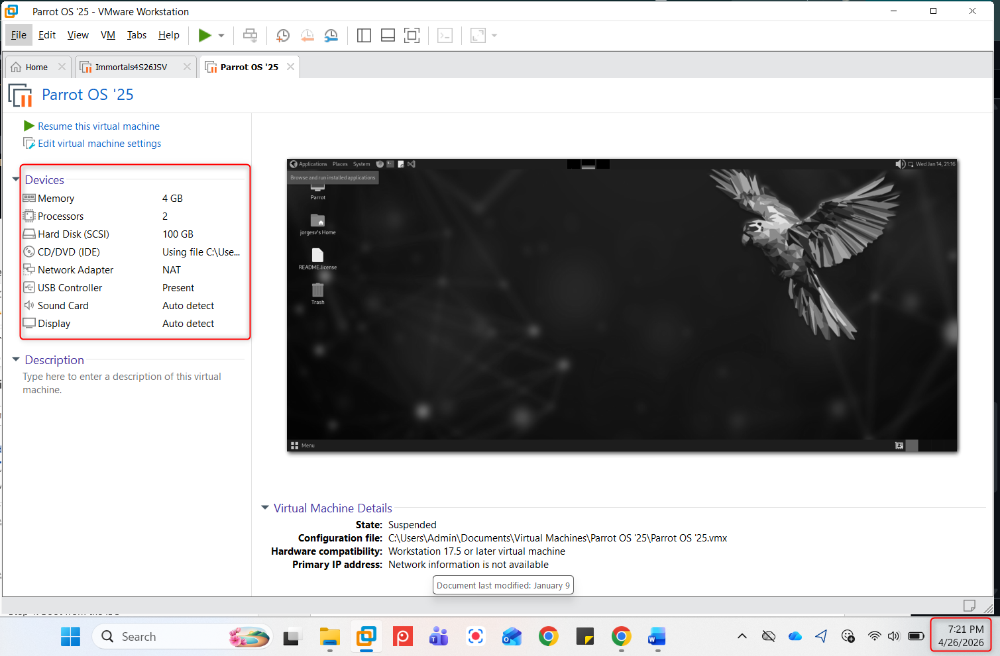
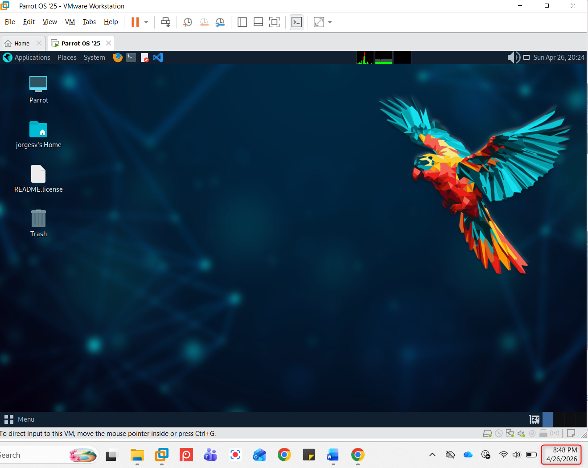
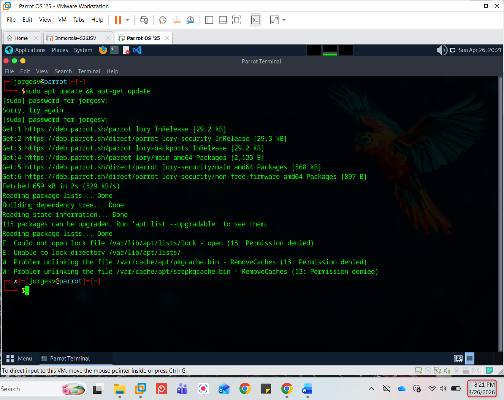

# Parrot OS Virtual Machine Lab

## Overview
This project documents the installation and configuration of Parrot Security OS in VMware Workstation as part of a cybersecurity operations lab.

The lab covers:

- Downloading and verifying the Parrot Security ISO
- Creating and configuring a Debian-based virtual machine
- Installing Parrot OS in VMware Workstation
- Configuring NAT networking
- Performing post-installation updates
- Validating connectivity and system readiness

---

## Technologies Used

- VMware Workstation Pro
- Parrot Security OS
- Debian Linux
- NAT Networking
- SHA/MD5 Checksum Verification

---

## Lab Architecture

User System  
↓  
VMware Workstation  
↓  
Parrot Security VM  
↓  
NAT Network Adapter  
↓  
Internet Connectivity

---

## Installation Steps

### 1. Download and Verify ISO
Downloaded the Parrot Security Edition (64-bit) ISO and validated integrity using checksum verification.

Example:

```bash
certutil -hashfile parrot.iso md5
```

---

### 2. Virtual Machine Configuration

Configured:

- 20 GB Virtual Disk
- 4 GB RAM
- 2 CPU Cores
- NAT Networking
- Debian 10.x 64-bit Guest OS

---

### 3. Parrot OS Installation

Performed installation using default partitioning and created:

- Root Account
- Standard User Account

---

### 4. Post-Installation Validation

Executed:

```bash
sudo apt update && sudo apt-get update
```

Validated:

- Package updates
- Network access
- Browser connectivity

---

## Screenshots

### ISO Verification


### VM Configuration


### Parrot Desktop


### Update Validation


---

## Skills Demonstrated

- Linux Administration
- Virtualization
- System Installation
- Network Configuration
- Integrity Verification
- Cybersecurity Lab Operations

---

## Documentation

Full lab write-up:

[Lab Assignment PDF](documentation/Install-parrot-os.pdf)
